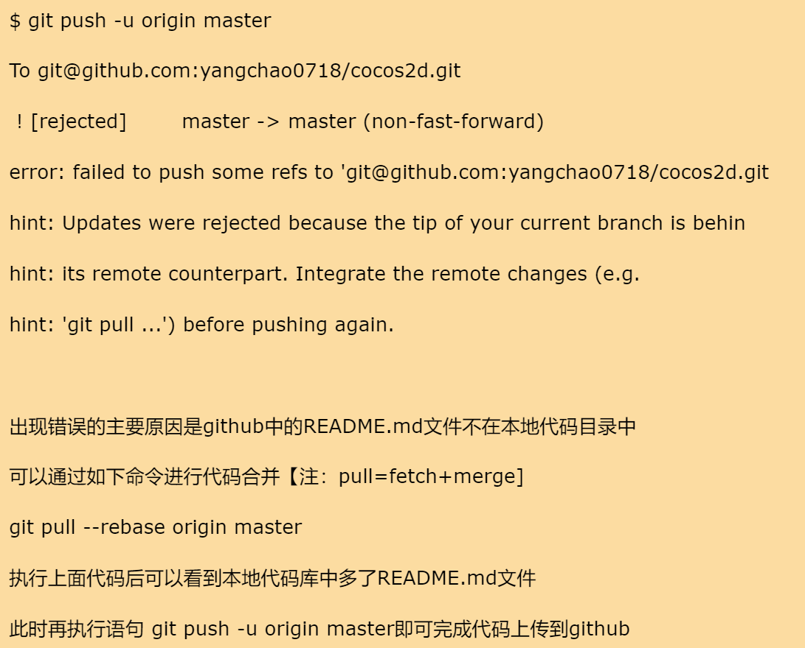
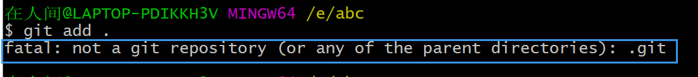
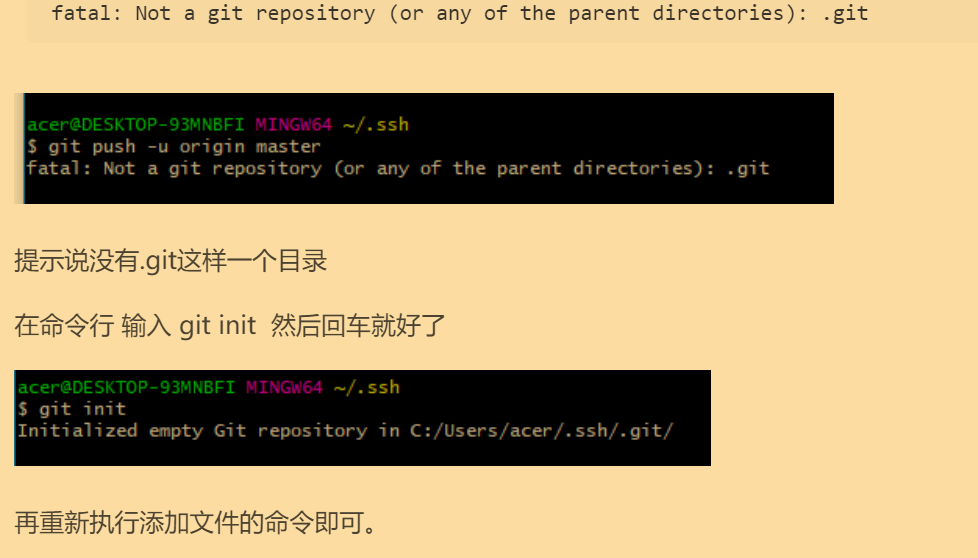

#### git的操作命令


##### 问题1：




https://www.cnblogs.com/sjhsszl/p/8708471.html


##### 问题2：





##### 问题3：

- 如果想要上传的时候增加文件操作

```shell
git add .
git commit -m "add ?"
git push
```

- 如果想要上传不是同一个文件夹里的东西，需要git pull在本地同步然后上传

```shell
git add .
git commit -m "add ?"

#如果这个文件夹是新的，没有上传过的
git remote add origin https://?

git pull --rebase origin master  #这个--后面可加可不加
git push -u origin master  #这个-u后面的第一次需要加，后面的如果还是这个分支，可加可不加
```


##### 正常的git上传文件：

…or create a new repository on the command line

```shell
echo "# admin" >> README.md
git init
git add README.md
git commit -m "first commit"
git remote add origin https://github.com/1198560751/admin.git
git push -u origin master
#然后第二次补充文件  
git add .
git commit -m "?"
git push
```

##### git常用的命令

```shell
常用的命令

git status --查看当前代码状态，改动，所在分支，是否有代码冲突等

git branch -a --查看当前主干下有哪些分支

git checkout --切换分支

git diff --查看分支代码改动 
```

##### git 删除方法：

```shell
$ git pull origin master                    # 将远程仓库里面的项目拉下来

$ dir                                                # 查看有哪些文件夹

$ git rm -r --cached .idea              # 删除.idea文件夹

$ git commit -m '删除.idea'        # 提交,添加操作说明

$ git push -u origin master               # 将本次更改更新到github项目上去
```

